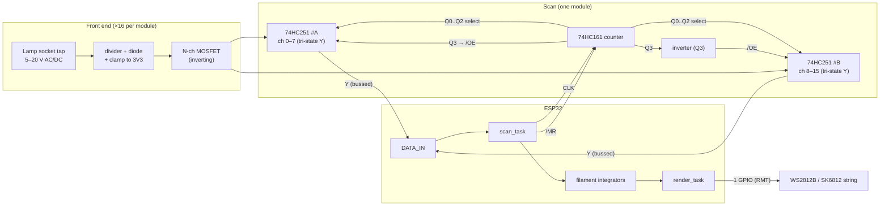

# Hardware Notes — `pinled` v2

Companion to `DOSSIER.md`. Front-end and interconnect detail for a 16-channel
module. Schematic/gerbers live in the hardware repo; this is the firmware-facing
contract.

## Block diagram

## ESP32 pin budget

| Signal | Direction | Scope | POC default (QT Py ESP32 Pico) |
|---|---|---|---|
| `CLK` | out | shared bus (all modules) | GPIO25 (A1) |
| `/MR` (reset) | out | shared bus (all modules) | GPIO27 (A2) |
| `DATA_IN` | in | one per module | GPIO26 (A0) |
| `LED` | out (RMT) | whole string | GPIO15 (A3) |

Per-module cost = **1 GPIO** (`DATA_IN`); `CLK`/`/MR`/`LED` are shared. So a
64-lamp game ≈ 4 modules ≈ **6 input-side GPIO + 1 LED GPIO**.

## 74HC251 vs 74HC151 (why the swap)

| | 74HC151 | 74HC251 |
|---|---|---|
| Function | 8:1 mux, outputs Y and W (=Ȳ) | 8:1 mux, outputs Y and W |
| Output type | **push-pull** | **tri-state** |
| Disabled (strobe high) | Y forced **low** (actively driven) | Y **high-Z** |
| Can bus two on one line? | ❌ contention | ✅ yes |

The tri-state output is what lets two '251s share `DATA_IN`. This is the
open-drain/tri-state distinction from the design discussion applied: you can't
wire-share push-pull outputs, you *can* wire-share high-Z ones.

## 74HC161 usage

- Synchronous 4-bit binary counter, **asynchronous** active-low clear (`/MR`).
- `Q0..Q2` → both '251 select inputs (A/B/C).
- `Q3` → '251#A `/OE` directly, and via one inverter → '251#B `/OE` (bank select).
- `CEP`/`CET` tied high (count enabled), `PE`/`/LOAD` tied high (no parallel load).
- `/MR` low pulse zeroes the count with no clock edge → clean frame start.

## Front-end (per channel) checklist

- **Level shift** 5–20 V lamp drive → 3.3 V logic. Common-source N-FET is
  simple and **inverts** (firmware `active_low`).
- **AC handling:** diode steers/rectifies AC taps. Do **not** RC-filter to DC in
  hardware — keep the digital pulse train fast so firmware recovers duty.
- **Trip point:** add hysteresis so dim/marginal drive doesn't chatter; design
  the divider for the full era voltage span (≈6.3 V GI to ≈18–20 V feature).
- **Protection:** gate series resistor, clamp FET output to 3V3 (Schottky/TVS or
  input protection diodes via series R). Respect HC abs-max VCC + 0.5 V.
- **Decoupling:** 0.1 µF at every IC VCC; keep logic ground away from
  high-current solenoid returns.

## Power
- Onboard 3V3 regulator from the machine's 5–12 V rail for logic.
- LED string power sized separately for the WS2812B/SK6812 count (≈60 mA/LED
  worst case white) — do not run the string off the logic regulator.
