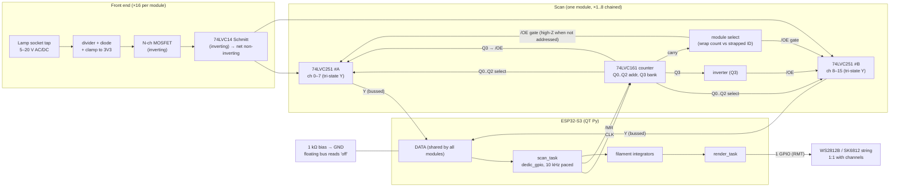

# Hardware Notes — `pinled` v2

Companion to `DOSSIER.md`. Front-end and interconnect detail for a 16-channel
module. Schematic/gerbers live in the hardware repo; this is the firmware-facing
contract.

## Block diagram

```mermaid
flowchart LR
    subgraph FE["Front end (×16 per module)"]
      TAP["Lamp socket tap<br/>5–20 V AC/DC"] --> DIV["divider + diode<br/>+ clamp to 3V3"]
      DIV --> FET["N-ch MOSFET<br/>(inverting)"]
      FET --> ST["74LVC14 Schmitt<br/>(inverting) → net non-inverting"]
    end

    subgraph MUX["Scan (one module, ×1..8 chained)"]
      A["74LVC251 #A<br/>ch 0–7 (tri-state Y)"]
      B["74LVC251 #B<br/>ch 8–15 (tri-state Y)"]
      C161["74LVC161 counter<br/>Q0..Q2 addr, Q3 bank"]
      INV["inverter (Q3)"]
      SEL["module select<br/>(wrap count vs strapped ID)"]
      C161 -- "Q0..Q2 select" --> A
      C161 -- "Q0..Q2 select" --> B
      C161 -- "Q3 → /OE" --> A
      C161 -- "Q3" --> INV -- "/OE" --> B
      C161 -- "carry" --> SEL
      SEL -- "/OE gate (high-Z when not addressed)" --> A
      SEL -- "/OE gate" --> B
    end

    ST --> A
    ST --> B
    A -- "Y (bussed)" --> DATA["DATA (shared by all modules)"]
    B -- "Y (bussed)" --> DATA
    BIAS["1 kΩ bias → GND<br/>floating bus reads 'off'"] --- DATA

    subgraph ESP["ESP32-S3 (QT Py)"]
      SCAN["scan_task<br/>dedic_gpio, 10 kHz paced"] -- "CLK" --> C161
      SCAN -- "/MR" --> C161
      DATA --> SCAN
      SCAN --> FIL["filament integrators"]
      FIL --> REN["render_task"]
    end

    REN -- "1 GPIO (RMT)" --> LED["WS2812B / SK6812 string<br/>1:1 with channels"]
```

## ESP32 pin budget

| Signal | Direction | Scope | GPIO (QT Py ESP32-S3) |
|---|---|---|---|
| `CLK` | out | shared bus (all modules) | 18 (A0) |
| `/MR` (reset) | out | shared bus (all modules) | 17 (A1) |
| `DATA_IN` | in | **shared bus (all modules)** | 9 (A2) |
| `LED` | out (RMT) | whole string | 8 (A3) |
| status pixel | out (RMT) | onboard | 39 (power enable 38) |
| profiler re-arm | in | onboard | 0 (BOOT button) |

Per-module GPIO cost = **zero**. Every module hangs off the same three-wire bus,
so 1 module and 8 modules cost the same 3 input-side GPIO + 1 LED GPIO. A
64-lamp game (4 modules) and a 128-lamp game (8 modules) are the same pin
budget.

> The POC pins (QT Py ESP32 Pico: 25/27/26/15) are **superseded and unusable
> here** — GPIO 26 and 27 are SPI flash pins on the ESP32-S3, and 15 and 25 are
> not broken out on this board.

### Bring-up on an ESP32-S3-DevKitC-1

The DevKit uses the **same GPIO numbers**, so firmware moves between the two
boards unchanged; only the physical location and the silkscreen differ. All four
signals plus power land on the single header opposite `IO19`/`IO20`:

| Signal | GPIO | QT Py label | DevKitC-1 (J1, counting from the antenna end) |
|---|---|---|---|
| `/MR` | 17 | `A1` | pin 10 |
| `CLK` | 18 | `A0` | pin 11 |
| `LED` | 8 | `A3` | pin 12 |
| `DATA_IN` | 9 | `A2` | pin 15 |
| `5V` | — | — | pin 21 |
| `GND` | — | — | pin 22 (plus 3× on the far header) |

Wire by the printed `IO` number, not by position — the header order above is a
counting aid. Note that `IO3` and `IO46` sit between `LED` and `DATA_IN`, which
is the easiest place to miscount.

Pins to keep clear on the DevKit:

- **33–37** — octal PSRAM on `N8R8` parts. In-package; broken out but unusable.
- **19/20** — native USB. These carry the flashing and console connection.
- **0, 3, 45, 46** — strapping pins. `GPIO 0` matters most: `DATA_IN` carries a
  1 kΩ pull-down (HW-2), and a 1 kΩ pull-down on `GPIO 0` forces ROM download
  mode at every boot.

The shipping product places a bare S3 on the mainboard, so the final pin map is
a free choice — but the same exclusions apply, and the `GPIO 0` trap in
particular is a function of the bias resistor, not of the dev board.

## 74HC251 vs 74HC151 (why the swap)

| | 74HC151 | 74HC251 |
|---|---|---|
| Function | 8:1 mux, outputs Y and W (=Ȳ) | 8:1 mux, outputs Y and W |
| Output type | **push-pull** | **tri-state** |
| Disabled (strobe high) | Y forced **low** (actively driven) | Y **high-Z** |
| Can bus two on one line? | ❌ contention | ✅ yes |

The tri-state output is what lets two '251s share `DATA_IN`. This is the
open-drain/tri-state distinction from the design discussion applied: you can't
wire-share push-pull outputs, you *can* wire-share high-Z ones.

The same property is what lets **all 8 modules** share one `DATA` line, not just
the two '251s within a module — the argument scales from 2 drivers to 16. Note
the table compares HC parts because that is the classic reference; v2 uses the
**LVC** equivalents for the drive and speed reasons in "Shared `DATA` bus"
above.

## 74HC161 usage

- Synchronous 4-bit binary counter, **asynchronous** active-low clear (`/MR`).
- `Q0..Q2` → both '251 select inputs (A/B/C).
- `Q3` → '251#A `/OE` directly, and via one inverter → '251#B `/OE` (bank select).
- `CEP`/`CET` tied high (count enabled), `PE`/`/LOAD` tied high (no parallel load).
- `/MR` low pulse zeroes the count with no clock edge → clean frame start.

## Chaining modules

Modules chain on a **5-pin JST-SH harness in ~100 mm hops**, up to 8 modules /
800 mm (HW-4):

| Pin | Signal |
|---|---|
| 1 | `CLK` |
| 2 | `/MR` |
| 3 | `DATA` |
| 4 | `GND` |
| 5 | `VIN` (labelled `VIN`, not `3V3` — see Power) |

Note what is *not* on the harness: no mux address lines and no inter-module
carry. Every module therefore has to derive both its channel address and its own
"am I selected right now" state locally, from nothing but the shared `CLK` and
`/MR`. Only the addressed module's '251s drive `DATA`; the rest sit in high-Z.

> **To confirm.** The reading that fits a 5-pin harness: each module carries its
> own address counter (0..15, in lockstep with every other module since they
> share `CLK`/`/MR`) plus a second counter chained off the first's carry, which
> counts address-counter wraps. That wrap count is compared against a
> strapped/jumpered module ID, and the match drives `/OE` on that module's two
> '251s. No inter-module carry wire needed — each module independently computes
> which module should be active. If the mechanism is different, the firmware
> timing model is unaffected (it is still one serial walk with a handoff every
> 16 channels), but the failure modes below change.
>
> Firmware-visible consequence either way: **module ID is set in hardware, so
> physical harness order must match the strapped IDs.** A missing ID leaves a
> 16-channel span reading the bias level (all-off, quietly), and a duplicated ID
> causes bus contention on that span. Both are detectable at boot and worth a
> diagnostic.

## Shared `DATA` bus

All modules bus their '251 outputs onto one line, so the bus needs defining when
nobody drives it — during the `/OE` handoff between modules, and across any
unpopulated span.

- **~1 kΩ bias resistor** (HW-2). Orientation follows front-end polarity: a
  floating bus must read *lamp off*, which with the non-inverting front end
  (HW-1) means a **pull-down**. Also gives a safe pre-boot state — bus low, all
  lamps dark, before firmware runs. If the front end is ever changed to
  inverting, this resistor flips too; they are one decision.
- **The MCU's internal pull must agree.** `gpio_reset_pin()` leaves the internal
  pull-**up** enabled and `gpio_set_direction()` does not clear it, so the
  obvious setup silently contradicts HW-2. `lamp_scan::init()` configures the
  pin explicitly and derives the internal pull from `active_low`. At ~45 kΩ it
  does not substitute for the 1 kΩ external bias; it only stops the MCU
  fighting it. During bench work with a **push-pull** mux ('151 rather than
  '251) the external bias should be omitted entirely — there is no high-Z state
  to define and it just loads the driver.
- **LVC/LV family, not HC** (HW-3). 1 kΩ against 3.3 V is 3.3 mA of standing
  load on whichever '251 is driving; an HC part at 3.3 V has roughly a 3 mA
  budget and may not reach a valid output level. LVC also slews the ~150 pF bus
  in ~20 ns against HC's ~124 ns, which is most of the module-boundary settle
  budget. A 4.7 kΩ bias with HC is the alternative and costs ~1.5 µs per
  boundary — roughly double the 128-channel frame time.
- **~100 Ω series termination on `CLK` at the source** (HW-5) — single ground
  return next to a fast clock in a 5-conductor harness.
- **Local decoupling is mandatory** (HW-5): 100 nF per IC + ~10 µF bulk per
  module. 800 mm of thin wire is ~0.5–0.8 µH of loop inductance; a '251 slamming
  150 pF cannot source that transient down the harness.

Estimated bus load at full extension is ~150 pF and the resulting settle budget
is ~100 ns in-module / ~200 ns at a boundary. Those are the load-bearing numbers
for the whole scan-rate model — see `TIMING.md` §2.3 and §4.

## Front-end (per channel) checklist

- **Level shift** 5–20 V lamp drive → 3.3 V logic. Common-source N-FET is
  simple and **inverts**.
- **Schmitt trigger** after the FET, *inverting* type (74LVC14 hex, or '1G14
  singles — a '17 is the non-inverting buffer and would leave the signal
  inverted). Two inversions cancel, so the front end is **non-inverting
  overall: lamp on → logic high** (HW-1), and firmware `active_low` defaults
  **off**. 16 channels needs 3× '14.
- **Hysteresis** comes from that Schmitt (V_hys ≈ 0.4–0.6 V at 3.3 V), and it is
  the primary defense against solenoid-induced ground bounce walking every
  channel's threshold at once. See `TIMING.md` §5.4.
- **AC handling:** diode steers/rectifies AC taps. Do **not** RC-filter to DC in
  hardware — keep the digital pulse train fast so firmware recovers duty.
- **Trip point:** design the divider for the full era voltage span (≈6.3 V GI to
  ≈18–20 V feature).
- The Schmitt costs nothing in scan timing: it sits *before* the mux, so its
  ~10 ns t_pd has long settled by the time the counter addresses that channel.
- **Protection:** gate series resistor, clamp FET output to 3V3 (Schottky/TVS or
  input protection diodes via series R). Respect HC abs-max VCC + 0.5 V.
- **Decoupling:** 0.1 µF at every IC VCC; keep logic ground away from
  high-current solenoid returns.

## Power

Regulation is independent of the QT Py; the board's own regulator runs only the
S3. Full derivation in `TIMING.md` §5.

- **Distribute 5 V, regulate 3.3 V locally per module** (HW-8). At a placeholder
  3 mA/channel the chain draws ~400 mA / 1.4 W, and 800 mm of 28–32 AWG drops
  136–340 mV — on a directly-distributed 3.3 V rail that is 10% of the budget
  spent for nothing; at 5 V in, the LDO's headroom absorbs it. Local LDO
  dissipation is ~85 mW/module. JST-SH is rated 1 A/contact.
- **An LDO to 5 V is only viable off the machine's existing +5 V rail.** From
  +12 V it burns 2.8 W; from the unregulated solenoid rail (~18–25 V, sagging to
  ~12 V on a coil fire) ~6 W. Either needs a buck — but *one* buck at the
  controller, whose output can be filtered before entering the harness, not
  eight per-module switchers sitting next to the sense bus.
- EM games may have no DC logic rail (6.3 VAC + ~25 VDC) → rectify-and-buck.
- **Ride-through** (HW-7): series Schottky + bulk electrolytic + kickback
  clamping at the input. The filament model smooths a signal glitch; it does not
  smooth an MCU brownout reset, which blacks out every lamp at once.
- **Grounding** (HW-6): not a star — the harness is a daisy chain and that is
  fine. What matters is a *single-point tie* between pinled ground and the
  machine's lamp-return ground, made near the lamp matrix return rather than at
  the PSU. Powering from the machine makes that tie the power tap itself.
- LED string power sized separately for the WS2812B/SK6812 count (≈60 mA/LED
  worst case white; ~6 A at 128 LEDs) — do not run the string off the logic
  regulator. Level-shift the LED data line or run the strip at reduced VDD
  (HW-9): WS2812B wants V_IH ≥ 0.7 × VDD = 3.5 V, above a 3.3 V S3 output.
