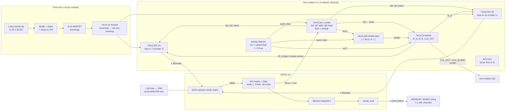

# Hardware Notes — `pinled` v2

Companion to `DOSSIER.md`. Front-end and interconnect detail for a 16-channel
module. Schematic/gerbers live in the hardware repo; this is the firmware-facing
contract.

## Block diagram


```mermaid
flowchart LR
    subgraph FE["Front end (×16 per module)"]
      TAP["Lamp socket tap<br/>5–20 V AC/DC"] --> DIV["divider + diode<br/>+ clamp to 3V3"]
      DIV --> FET["N-ch MOSFET<br/>(inverting)"]
      FET --> ST["74LVC14 Schmitt<br/>(inverting) → net non-inverting"]
    end

    subgraph MOD["One module (×1..8 chained, identical)"]
      A["74LVC251 #A<br/>lines 0–7 (3-state Y)"]
      B["74LVC251 #B<br/>lines 8–15 (3-state Y)"]
      C161["74LVC161 counter<br/>QA..QC addr, QD bank<br/>ENP = /DONE"]
      FF["74LVC109 DONE latch<br/>J = RCO, K̄ = 1"]
      ACT["activity detector<br/>D1 + 12kΩ/470pF<br/>τ ≈ 5.6 µs"]
      GATE["74LVC10 NAND<br/>/E_A, /E_B, CLK_OUT"]
      LDO["3V3 LDO<br/>(local, from 5 V)"]
      C161 -- "QA..QC select" --> A
      C161 -- "QA..QC select" --> B
      C161 -- "QD → bank" --> GATE
      C161 -- "RCO" --> FF
      FF -- "DONE" --> GATE
      ACT -- "ACT" --> GATE
      ACT -- "async clear" --> C161
      ACT -- "async clear" --> FF
      GATE -- "/E_A (high-Z unless active)" --> A
      GATE -- "/E_B" --> B
    end

    ST --> A
    ST --> B
    A -- "Y (bussed)" --> DATA["DATA (shared, whole chain)"]
    B -- "Y (bussed)" --> DATA
    BIAS["1 kΩ bias → GND<br/>at the MASTER only"] --- DATA

    GATE -- "CLK_OUT = CLK_IN AND DONE" --> NEXT["next module (J2)"]

    subgraph ESP["ESP32-S3"]
      SPI["SPI master + DMA<br/>mode 1, 2 MHz, 16·N bits"] -- "SCLK = CLK" --> C161
      DATA -- "MISO" --> SPI
      SPI --> FIL["filament integrators"]
      FIL --> REN["render_task"]
    end

    REN -- "1 GPIO (RMT)" --> LED["WS2812B / SK6812 string<br/>1:1 with channels"]
```

## ESP32 pin budget

| Signal | Direction | Scope | GPIO (QT Py ESP32-S3) |
|---|---|---|---|
| `CLK` (SPI `SCLK`) | out | chain input; forwarded module to module | 18 (A0) |
| `DATA` (SPI `MISO`) | in | **shared bus (all modules)** | 9 (A2) |
| `LED` | out (RMT) | whole string | 8 (A3) |
| status pixel | out (RMT) | onboard | 39 (power enable 38) |
| profiler re-arm | in | onboard | 0 (BOOT button) |

Per-module GPIO cost = **zero**, and the sense side now costs just **two** pins:
`CLK` and `DATA`. GPIO 17, previously `/MR`, is free — the frame reset is a
clock-idle timeout, so there is no reset conductor. A 64-lamp game (4 modules)
and a 128-lamp game (8 modules) are the same pin budget.

> The POC pins (QT Py ESP32 Pico: 25/27/26/15) are **superseded and unusable
> here** — GPIO 26 and 27 are SPI flash pins on the ESP32-S3, and 15 and 25 are
> not broken out on this board.

### Bring-up on an ESP32-S3-DevKitC-1

The DevKit uses the **same GPIO numbers**, so firmware moves between the two
boards unchanged; only the physical location and the silkscreen differ. All four
signals plus power land on the single header opposite `IO19`/`IO20`:

| Signal | GPIO | QT Py label | DevKitC-1 (J1, counting from the antenna end) |
|---|---|---|---|
| `CLK` | 18 | `A0` | pin 11 |
| `LED` | 8 | `A3` | pin 12 |
| `DATA_IN` | 9 | `A2` | pin 15 |
| `5V` | — | — | pin 21 |
| `GND` | — | — | pin 22 (plus 3× on the far header) |

Wire by the printed `IO` number, not by position — the header order above is a
counting aid. Note that `IO3` and `IO46` sit between `LED` and `DATA_IN`, which
is the easiest place to miscount.

Pins to keep clear on the DevKit:

- **33–37** — octal PSRAM on `N8R8` parts. In-package; broken out but unusable.
- **19/20** — native USB. These carry the flashing and console connection.
- **0, 3, 45, 46** — strapping pins. `GPIO 0` matters most: `DATA_IN` carries a
  1 kΩ pull-down (HW-2), and a 1 kΩ pull-down on `GPIO 0` forces ROM download
  mode at every boot.

The shipping product places a bare S3 on the mainboard, so the final pin map is
a free choice — but the same exclusions apply, and the `GPIO 0` trap in
particular is a function of the bias resistor, not of the dev board.

## 74HC251 vs 74HC151 (why the swap)

| | 74HC151 | 74HC251 |
|---|---|---|
| Function | 8:1 mux, outputs Y and W (=Ȳ) | 8:1 mux, outputs Y and W |
| Output type | **push-pull** | **tri-state** |
| Disabled (strobe high) | Y forced **low** (actively driven) | Y **high-Z** |
| Can bus two on one line? | ❌ contention | ✅ yes |

The tri-state output is what lets two '251s share `DATA_IN`. This is the
open-drain/tri-state distinction from the design discussion applied: you can't
wire-share push-pull outputs, you *can* wire-share high-Z ones.

The same property is what lets **all 8 modules** share one `DATA` line, not just
the two '251s within a module — the argument scales from 2 drivers to 16. Note
the table compares HC parts because that is the classic reference; v2 uses the
**LVC** equivalents for the drive and speed reasons in "Shared `DATA` bus"
above.

## '161 usage

- Synchronous 4-bit binary counter, **asynchronous** active-low clear driven by
  the activity detector (not by any external wire).
- Clocked on the **falling** edge of `CLK` (the incoming clock is Schmitt-
  inverted), which is what keeps the handoff free of runt pulses.
- `QA..QC` → both '251 select inputs.
- `QD` → bank select, gated into `/E_A` / `/E_B` rather than driving them directly.
- `ENT` tied high; **`ENP` = `/DONE`**, so the counter parks at 0 after its wrap
  instead of running a second lap.
- `/LOAD` tied high, load inputs grounded (no parallel load).
- `RCO` goes only to the DONE latch's `J` input — never to a clock or an async
  control. See `CHAINING.md` for why that distinction matters.

## Chaining modules

Modules chain on a **4-pin JST-SH harness in ~100 mm hops**, up to 8 modules /
800 mm (HW-4). Full protocol in [`CHAINING.md`](CHAINING.md).

| Pin | Signal |
|---|---|
| 1 | `VCC` (5 V — each module regulates 3.3 V locally, HW-8) |
| 2 | `GND` |
| 3 | `DATA` |
| 4 | `CLK` |

**There is no reset conductor and no addressing.** Modules are identical and
interchangeable; nothing is strapped, jumpered, or configured per module.

Each module forwards the clock only once it has finished its own 16 lines:

```
CLK_OUT = CLK_IN AND DONE
```

so a module that is still counting starves everything downstream, and the act of
receiving a clock *is* the grant. The master issues 16xN clocks and every line
appears on `DATA` exactly once, in order. A `/MR` wire is unnecessary because the
frame reset is a **clock-idle timeout**: hold `CLK` low for >= 5*tau and the
per-module RC activity detectors discharge, async-clearing every counter and DONE
latch. That also makes a glitched frame self-healing.

Firmware-visible consequences:

- **Only `N` is configured.** No IDs to get wrong, so the missing-ID and
  duplicate-ID faults of the old scheme are gone.
- **A module that never asserts DONE kills everything downstream**, because the
  clock stops there. This is a regression against the old scheme, where a bad
  module cost only its own 16 channels. A chain returning all-zeros beyond
  channel 16k is the diagnostic signature.
- **Physical order is electrical order** — module 1 is whichever is nearest the
  master. Reordering the harness renumbers the channels.
- **The chain cannot be single-stepped.** Bus grant is held on an RC, so slow
  clocking discharges it. The slow-step and hold-channel bring-up modes are
  valid only on a bench rig without the activity detector (see `BRINGUP.md`).

## Shared `DATA` bus

All modules bus their '251 outputs onto one line, so the bus needs defining when
nobody drives it — during the handoff between modules, before the first module
arms, and after the last one finishes.

- **~1 kΩ bias resistor** (HW-2). Orientation follows front-end polarity: a
  floating bus must read *lamp off*, which with the non-inverting front end
  (HW-1) means a **pull-down**. Also gives a safe pre-boot state — bus low, all
  lamps dark, before firmware runs. If the front end is ever changed to
  inverting, this resistor flips too; they are one decision.
- **The MCU's internal pull must agree.** `gpio_reset_pin()` leaves the internal
  pull-**up** enabled and `gpio_set_direction()` does not clear it, so the
  obvious setup silently contradicts HW-2. `lamp_scan::init()` configures the
  pin explicitly and derives the internal pull from `active_low`. At ~45 kΩ it
  does not substitute for the 1 kΩ external bias; it only stops the MCU
  fighting it. During bench work with a **push-pull** mux ('151 rather than
  '251) the external bias should be omitted entirely — there is no high-Z state
  to define and it just loads the driver.
- **LVC family, not HC** (HW-3). Two independent reasons, and the second is the
  binding one:
  1. 1 kΩ against 3.3 V is 3.3 mA of standing load on whichever '251 drives; an
     HC part at 3.3 V has roughly a 3 mA budget and may not reach a valid level.
     LVC's ±24 mA makes this a non-issue.
  2. **Clock skew down the chain.** Each module inserts a NAND plus a Schmitt
     inverter into the forwarded clock. At 3.3 V that is ~50–70 ns per module
     for HC — about 0.5 µs across 8 modules — which walks the far modules out of
     the master's sample slot and fails as a function of chain length. LVC's
     ~5–6.5 ns per gate keeps the whole chain inside ~100 ns.
- **~100 Ω series termination on `CLK_OUT` at each module's source** (HW-5) —
  a single ground return next to a fast clock in a 4-conductor harness.
- **Local decoupling is mandatory** (HW-5): 100 nF per IC + ~10 µF bulk per
  module. 800 mm of thin wire is ~0.5–0.8 µH of loop inductance; a '251 slamming
  150 pF cannot source that transient down the harness.

Estimated bus load at full extension is ~150 pF; an LVC '251 slews that in
~20 ns, comfortably inside a 500 ns bit slot at 2 MHz. The handoff between
modules is a half-period high-Z window that carries no sample, so it needs no
settle budget of its own — see `TIMING.md` §2.3.

## Front-end (per channel) checklist

- **Level shift** 5–20 V lamp drive → 3.3 V logic. Common-source N-FET is
  simple and **inverts**.
- **Schmitt trigger** after the FET, *inverting* type (74LVC14 hex, or '1G14
  singles — a '17 is the non-inverting buffer and would leave the signal
  inverted). Two inversions cancel, so the front end is **non-inverting
  overall: lamp on → logic high** (HW-1), and firmware `active_low` defaults
  **off**. 16 channels needs 3× '14.
- **Hysteresis** comes from that Schmitt (V_hys ≈ 0.4–0.6 V at 3.3 V), and it is
  the primary defense against solenoid-induced ground bounce walking every
  channel's threshold at once. See `TIMING.md` §5.4.
- **AC handling:** diode steers/rectifies AC taps. Do **not** RC-filter to DC in
  hardware — keep the digital pulse train fast so firmware recovers duty.
- **Trip point:** design the divider for the full era voltage span (≈6.3 V GI to
  ≈18–20 V feature).
- The Schmitt costs nothing in scan timing: it sits *before* the mux, so its
  ~10 ns t_pd has long settled by the time the counter addresses that channel.
- **Protection:** gate series resistor, clamp FET output to 3V3 (Schottky/TVS or
  input protection diodes via series R). Respect HC abs-max VCC + 0.5 V.
- **Decoupling:** 0.1 µF at every IC VCC; keep logic ground away from
  high-current solenoid returns.

## Power

Regulation is independent of the QT Py; the board's own regulator runs only the
S3. Full derivation in `TIMING.md` §5.

- **Distribute 5 V, regulate 3.3 V locally per module** (HW-8). This is now
  *required*, not preferred: LVC is not a 5 V part, so the harness rail and the
  logic rail cannot be the same. Every module carries its own LDO and the
  4-pin harness `VCC` is 5 V throughout. At a placeholder 3 mA/channel plus
  ~20 mA of switching logic the chain draws ~560 mA, and 800 mm of 28–32 AWG
  drops 136–340 mV — which the LDO headroom absorbs at 5 V but would be 10% of
  the budget on a directly-distributed 3.3 V rail. Local LDO dissipation is
  ~120 mW/module. JST-SH is rated 1 A/contact.
- **An LDO to 5 V is only viable off the machine's existing +5 V rail.** From
  +12 V it burns 2.8 W; from the unregulated solenoid rail (~18–25 V, sagging to
  ~12 V on a coil fire) ~6 W. Either needs a buck — but *one* buck at the
  controller, whose output can be filtered before entering the harness, not
  eight per-module switchers sitting next to the sense bus.
- EM games may have no DC logic rail (6.3 VAC + ~25 VDC) → rectify-and-buck.
- **Ride-through** (HW-7): series Schottky + bulk electrolytic + kickback
  clamping at the input. The filament model smooths a signal glitch; it does not
  smooth an MCU brownout reset, which blacks out every lamp at once.
- **Grounding** (HW-6): not a star — the harness is a daisy chain and that is
  fine. What matters is a *single-point tie* between pinled ground and the
  machine's lamp-return ground, made near the lamp matrix return rather than at
  the PSU. Powering from the machine makes that tie the power tap itself.
- LED string power sized separately for the WS2812B/SK6812 count (≈60 mA/LED
  worst case white; ~6 A at 128 LEDs) — do not run the string off the logic
  regulator. Level-shift the LED data line or run the strip at reduced VDD
  (HW-9): WS2812B wants V_IH ≥ 0.7 × VDD = 3.5 V, above a 3.3 V S3 output.
