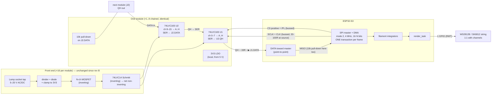

# Hardware Notes — `pinled` v2

Companion to `DOSSIER.md`. Front-end and interconnect detail for a 16-channel
module. Schematic/gerbers live in the hardware repo; this is the firmware-facing
contract.

## Block diagram

```mermaid
flowchart LR
    subgraph FE["Front end (×16 per module) — unchanged since rev B"]
      TAP["Lamp socket tap<br/>5–20 V AC/DC"] --> DIV["divider + diode<br/>+ clamp to 3V3"]
      DIV --> FET["N-ch MOSFET<br/>(inverting)"]
      FET --> ST["74LVC14 Schmitt<br/>(inverting) → net non-inverting"]
    end

    subgraph MOD["One module (×1..8 chained, identical)"]
      U2["74LVC165 U2<br/>ch 8–15 → A..H<br/>SER ← J2.DATA"]
      U1["74LVC165 U1<br/>ch 0–7 → A..H<br/>SER ← U2.QH"]
      LDO["3V3 LDO<br/>(local, from 5 V)"]
      R1["10k pull-down<br/>on J2.DATA"]
      U2 -- "QH → SER" --> U1
    end

    ST --> U1
    ST --> U2

    NEXT["next module (J2)<br/>QH out"] -- "DATA in" --> U2
    R1 --- NEXT
    U1 -- "QH ─ 33R ─▶ J1.DATA" --> DATAUP["DATA toward master<br/>(point-to-point)"]

    subgraph ESP["ESP32-S3"]
      SPI["SPI master + DMA<br/>mode 2, 4 MHz, 16·N bits<br/>ONE transaction per frame"]
      SPI -- "SCLK = CLK (bussed, 33-100R at source)" --> U1
      SPI -- "CS positive = /PL (bussed)" --> U1
      DATAUP -- "MISO (10k pull-down here too)" --> SPI
      SPI --> FIL["filament integrators"]
      FIL --> REN["render_task"]
    end

    REN -- "1 GPIO (RMT)" --> LED["WS2812B / SK6812 string<br/>1:1 with channels"]
```

`CLK` and `/PL` reach both registers in every module; only `DATA` is chained.
Two logic ICs per module — down from six in rev C.

## ESP32 pin budget

| Signal | Direction | Scope | GPIO (QT Py ESP32-S3) |
|---|---|---|---|
| `CLK` (SPI `SCLK`) | out | **bussed to all modules** | 18 (A0) |
| `/PL` (SPI `CS`, positive) | out | **bussed to all modules** | 17 (A1) |
| `DATA` (SPI `MISO`) | in | point-to-point from module 1 | 9 (A2) |
| `LED` | out (RMT) | whole string | 8 (A3) |
| status pixel | out (RMT) | onboard; **own GPIO on the mainboard**, never the playfield string (HW-15) | 39 (power enable 38) |
| button | in | onboard; short = re-profile, short-while-staged = confirm OTA, long = erase network (HW-16) | 0 (BOOT button) |

Per-module GPIO cost = **zero**; the sense side costs **three** pins regardless
of chain length, and all three can come from one SPI peripheral (`SCLK`, `MISO`,
and `CS` wired as `/PL`). A 64-lamp game (4 modules) and a 128-lamp game (8
modules) are the same pin budget.

> The POC pins (QT Py ESP32 Pico: 25/27/26/15) are **superseded and unusable
> here** — GPIO 26 and 27 are SPI flash pins on the ESP32-S3, and 15 and 25 are
> not broken out on this board.

### Bring-up on an ESP32-S3-DevKitC-1

The DevKit uses the **same GPIO numbers**, so firmware moves between the two
boards unchanged; only the physical location and the silkscreen differ. All four
signals plus power land on the single header opposite `IO19`/`IO20`:

| Signal | GPIO | QT Py label | DevKitC-1 (J1, counting from the antenna end) |
|---|---|---|---|
| `CLK` | 18 | `A0` | pin 11 |
| `/PL` | 17 | `A1` | pin 10 |
| `LED` | 8 | `A3` | pin 12 |
| `DATA_IN` | 9 | `A2` | pin 15 |
| `5V` | — | — | pin 21 |
| `GND` | — | — | pin 22 (plus 3× on the far header) |

Wire by the printed `IO` number, not by position — the header order above is a
counting aid. Note that `IO3` and `IO46` sit between `LED` and `DATA_IN`, which
is the easiest place to miscount.

Pins to keep clear on the DevKit:

- **33–37** — octal PSRAM on `N8R8` parts. In-package; broken out but unusable.
- **19/20** — native USB. These carry the flashing and console connection.
- **0, 3, 45, 46** — strapping pins. `GPIO 0` matters most: `DATA_IN` carries a
  10 kΩ pull-down (HW-2), and a pull-down on `GPIO 0` forces ROM download
  mode at every boot.

The shipping product places a bare S3 on the mainboard, so the final pin map is
a free choice — but the same exclusions apply, and the `GPIO 0` trap in
particular is a function of the bias resistor, not of the dev board.

## Why a shift register and not a mux (rev C → rev D)

Rev C used a '161 counter addressing two tri-state '251 muxes, plus '109 latches
and gating to decide whose turn it was on a shared bus — six logic ICs building a
distributed state machine whose only job was taking turns. A shift register does
that with no state machine, because taking turns is what a shift register *is*.

| | rev C ('161 + 2× '251 + '109 + '10 + '14) | rev D (2× '165) |
|---|---|---|
| Logic ICs per module | 6 | **2** |
| `DATA` topology | shared 3-state bus, arbitrated | point-to-point, push-pull |
| Output type needed | tri-state (hence '251, not '151) | push-pull — the '165 has no tri-state variant and needs none |
| Clock | forwarded conditionally, regenerated per hop | bussed |
| Clocks per module | 17 (one spent arming) | **16** |
| Capture | swept — ch0 and ch127 35 µs apart | **simultaneous**, on one `/PL` edge |
| Partial population | trailing samples read the master's bias | trailing samples read a local hard 0 |

The tri-state/push-pull argument that drove the '151 → '251 swap in rev B is now
moot: nothing shares a line, so nothing needs to release one.

## '165 usage

- 8-bit parallel-in / serial-out shift register. Two per module: `U1` = channels
  0–7 (nearest the master), `U2` = channels 8–15 feeding `U1.SER`.
- **`/PL` (pin 1) is level-sensitive, not edged.** Low = the eight parallel
  inputs load transparently and `CLK` is ignored; high = frozen and shifting. The
  capture instant is therefore the *rising* edge of `/PL`, and it is common to
  every register in the chain.
- Shifts `A → B → … → H → QH` on the **rising** edge of `CLK`. This is why the
  master runs SPI **mode 2** — sampling on the falling edge lands mid-cell.
- **Wire channel 0 to input `H`** (pin 6), counting down to channel 7 on `A`
  (pin 11). `H` is the first bit out, so this ordering makes the received stream
  ascend by channel and the driver's unpack a straight MSB-first bit walk.
- **Take `QH` (pin 9); leave `/QH` (pin 7) unconnected** (HW-12). `/QH` is a
  perfectly good complementary output, but inverting the serial path would make
  an absent module's pull-down read as every channel *on* rather than off.
- **`CLK INH` (pin 15) tied low.** Floating or high stops that register shifting,
  which shows up as eight repeated channels plus dead downstream modules — an
  easy fault to misdiagnose.
- The '165's supply is pin 16 and its ground is pin 8. Pin 15 is `CLK INH`, not a
  supply pin, despite sitting next to `VCC`.

> **Partly confirmed against silicon, 2026-08-06/07.** A working 4× 74HC165
> rig proves pins 1 (`/PL`), 2 (`CLK`), 8 (`GND`), 9 (`QH`), 10 (`SER`),
> 15 (`CLK INH`) and 16 (`VCC`) by running at all. Pins 14 (`D`) and 6 (`H`)
> are confirmed by button press — pin 6 matters most, since channel 0 is the
> only channel whose capture timing differs, being the bit `/PL` presents
> before any clock. Pins 11/12 (`A`/`B`) rest on a floating-input signature
> only, which is weaker. **Pins 3, 4, 5 and 13 (`E`, `F`, `G`, `C`) are still
> unexercised** — confirm those against a datasheet before layout.

## Chaining modules

Modules chain on a **5-pin JST-SH harness in ~100 mm hops**, up to 8 modules /
800 mm (HW-4). Full protocol in [`CHAINING.md`](CHAINING.md).

| Pin | Signal | `J1` (toward master) | `J2` (downstream) |
|---|---|---|---|
| 1 | `VCC` (5 V — each module regulates 3.3 V locally, HW-8) | pass-through | pass-through |
| 2 | `GND` | pass-through | pass-through |
| 3 | `DATA` | **output** (`U1.QH` via 33 Ω) | **input** (`U2.SER`, 10 kΩ to GND) |
| 4 | `CLK` | pass-through | pass-through |
| 5 | `/PL` | pass-through | pass-through |

**No addressing.** Modules are identical and interchangeable; nothing is
strapped, jumpered, or configured per module.

`CLK` and `/PL` are bussed to every module. `DATA` is the only signal that
differs end to end — it chains `QH` → `SER`, so each hop has exactly one
push-pull driver and the whole harness behaves as one 16·N-bit shift register.

The master drops `/PL` (all registers transparently follow their inputs), raises
it (**every channel in the chain freezes on that edge**), then clocks 16·N bits
out in a single SPI transaction. Driving `/PL` from the SPI `CS` line with
positive polarity makes the capture hardware-timed.

> **`J1` and `J2` are not interchangeable** (HW-13). `J1.3` drives; `J2.3`
> receives. A module fitted backwards ties two push-pull outputs together — key
> or gender the connectors so it cannot happen. The 33 Ω series resistor limits
> the fault current if it does.

Firmware-visible consequences:

- **Only `N` is configured**, and a wrong value is benign in both directions
  (`CHAINING.md`, FR-SCAN-11). Too high reads hard zeros; too low leaves trailing
  modules unread. Neither misaligns the channels that are present.
- **A missing or unpowered module blanks everything downstream of it** — its `QH`
  stops driving and the receiving pull-down holds the net at 0. Modules nearer
  the master are unaffected. All-zeros beyond channel 16k is the signature.
- **Physical order is electrical order** — module 1 is whichever is nearest the
  master. Reordering the harness renumbers the channels.
- **The chain can be single-stepped**, and holding `/PL` low is a useful static
  state: the registers stay transparent, so `DATA` tracks module 1 channel 0 live
  and a meter can follow a button press in real time.

## The `DATA` chain and its terminator

Rev D has no shared data bus. Each `DATA` net is a single hop with exactly one
push-pull driver, so it never floats *while its driver is fitted and powered* —
the only case needing definition is when it is not.

- **10 kΩ pull-down at every receiving end** (HW-2, HW-11): one per module on
  `J2.3`, plus one at the master on `MISO`. A fitted driver swamps it completely
  (0.33 mA); an absent one leaves a hard 0, which with the non-inverting front
  end (HW-1) means *lamp off*. This is what makes the chain **self-terminating** —
  a two-module harness on an eight-module configuration reads zeros for the
  missing 96 channels with no terminator plug and no build variant. It also gives
  a safe pre-boot state: all lamps dark before firmware runs.
- **Orientation is one decision with HW-1 and HW-12.** Flip the front end to
  inverting and this resistor flips too. Take `/QH` instead of `QH` and the
  terminator inverts *without* the resistor moving — which is why HW-12 forbids
  it.
- **The MCU's internal pull must agree.** `gpio_reset_pin()` leaves the internal
  pull-**up** enabled and `gpio_set_direction()` does not clear it, so the
  obvious setup silently contradicts HW-2. `lamp_scan::init()` configures the pin
  explicitly and derives the internal pull from `active_low`. At ~45 kΩ it works
  alongside the external 10 kΩ rather than substituting for it.
- **33 Ω in series with each `QH`** before `J1` (HW-5). Source-terminates the
  point-to-point hop, and limits the fault current if a module is fitted
  backwards and two outputs meet.
- **33–100 Ω series on `CLK` at the master only** (HW-5). `CLK` is now the one
  multi-drop signal in the harness, so termination belongs at the bus source, not
  at each receiver. This is a real regression from rev C, where `CLK` was
  point-to-point and re-driven at every hop — see `TIMING.md` §4.3.
- **Daisy the `CLK` bus along the harness, do not star-wire it** (HW-14). Clock
  travelling in the same direction as the connectors keeps each module clocked
  before the one feeding it, so harness skew adds to the inter-device hold margin
  instead of eroding it.
- **Local decoupling is mandatory** (HW-5): 100 nF per IC + ~10 µF bulk per
  module. 800 mm of thin wire is ~0.5–0.8 µH of loop inductance and cannot source
  a switching transient down the harness.

Family choice (HW-3) is now a preference rather than a correctness requirement:
the old 1 kΩ standing load that made HC marginal is gone, and there is no
per-hop gate delay left to accumulate. LVC is still preferred for edge rate into
the multi-drop clock; **74HC165 in DIP is the right part for a breadboard bench
build** at **≤ 4 MHz** — relaxed from 2 MHz on 2026-08-07 after a 4-chip rig ran
clean at 4 MHz for millions of frames.

## Front-end (per channel) checklist

- **Level shift** 5–20 V lamp drive → 3.3 V logic. Common-source N-FET is
  simple and **inverts**.
- **Schmitt trigger** after the FET, *inverting* type (74LVC14 hex, or '1G14
  singles — a '17 is the non-inverting buffer and would leave the signal
  inverted). Two inversions cancel, so the front end is **non-inverting
  overall: lamp on → logic high** (HW-1), and firmware `active_low` defaults
  **off**. 16 channels needs 3× '14.
- **Hysteresis** comes from that Schmitt (V_hys ≈ 0.4–0.6 V at 3.3 V), and it is
  the primary defense against solenoid-induced ground bounce walking every
  channel's threshold at once. See `TIMING.md` §5.4.
- **AC handling: half-wave rectify** the tap. A single diode is enough — the
  goal is a clean digital pulse train, not a DC level. Do **not** RC-filter to
  DC in hardware; keep it fast so firmware recovers duty. Half-wave also means
  the sensed envelope is at the line rate rather than twice it, which the
  profiler's `AC_STEADY`/`AC_DIMMED` thresholds must match — measure it, do not
  assume 50 vs 60 vs 100 vs 120 Hz.
- **Phantom load (power resistor), jumper-selectable per channel.** The
  original incandescent is **removed** — replacing it is the entire point — and
  it was doing two electrical jobs besides making light:
  1. **Holding an SCR latched.** Bally/Stern-era lamp drivers latch with SCRs,
     which conduct only while their load draws holding current. A ~250 mA bulb
     supplied that for free; a high-impedance sense tap does not, and the lamp
     never properly turns on. The known field fix is ~470 Ω across the socket
     (~13 mA at 6.3 VAC).
  2. **Loading the lamp supply so it regulates.** These rails are unregulated
     and specified under load. Strip most of the load out of a machine and the
     rail climbs out of spec, which is a whole-system effect rather than a
     per-lamp one — it does not announce itself as "this lamp flickers."
  Hence **power** resistors, not signal resistors, and **jumpers** so the load
  is fitted only where a machine needs it. A modern transistor-driven game with
  a regulated supply wants none; a Bally/Stern SCR machine wants them
  populated. Budget the dissipation deliberately — see `TIMING.md` §5.1, where
  this dominates the front end rather than the FET does.
- **Trip point:** design the divider for the full era voltage span (≈6.3 V GI to
  ≈18–20 V feature).
- The Schmitt costs nothing in scan timing: it sits *before* the mux, so its
  ~10 ns t_pd has long settled by the time the counter addresses that channel.
- **Protection:** gate series resistor, clamp FET output to 3V3 (Schottky/TVS or
  input protection diodes via series R). Respect HC abs-max VCC + 0.5 V.
- **Decoupling:** 0.1 µF at every IC VCC; keep logic ground away from
  high-current solenoid returns.

## Power

Regulation is independent of the QT Py; the board's own regulator runs only the
S3. Full derivation in `TIMING.md` §5.

- **Distribute 5 V, regulate 3.3 V locally per module** (HW-8). This is now
  *required*, not preferred: LVC is not a 5 V part, so the harness rail and the
  logic rail cannot be the same. Every module carries its own LDO and the
  5-pin harness `VCC` is 5 V throughout. At a placeholder 3 mA/channel plus
  ~20 mA of switching logic the chain draws ~560 mA, and 800 mm of 28–32 AWG
  drops 136–340 mV — which the LDO headroom absorbs at 5 V but would be 10% of
  the budget on a directly-distributed 3.3 V rail. Local LDO dissipation is
  ~120 mW/module. JST-SH is rated 1 A/contact.
- **An LDO to 5 V is only viable off the machine's existing +5 V rail.** From
  +12 V it burns 2.8 W; from the unregulated solenoid rail (~18–25 V, sagging to
  ~12 V on a coil fire) ~6 W. Either needs a buck — but *one* buck at the
  controller, whose output can be filtered before entering the harness, not
  eight per-module switchers sitting next to the sense bus.
- EM games may have no DC logic rail (6.3 VAC + ~25 VDC) → rectify-and-buck.
- **Ride-through** (HW-7): series Schottky + bulk electrolytic + kickback
  clamping at the input. The filament model smooths a signal glitch; it does not
  smooth an MCU brownout reset, which blacks out every lamp at once.
- **Grounding** (HW-6): not a star — the harness is a daisy chain and that is
  fine. What matters is a *single-point tie* between pinled ground and the
  machine's lamp-return ground, made near the lamp matrix return rather than at
  the PSU. Powering from the machine makes that tie the power tap itself.
- LED string power sized separately for the WS2812B/SK6812 count (≈60 mA/LED
  worst case white; ~6 A at 128 LEDs) — do not run the string off the logic
  regulator. Level-shift the LED data line or run the strip at reduced VDD
  (HW-9): WS2812B wants V_IH ≥ 0.7 × VDD = 3.5 V, above a 3.3 V S3 output.

  **Measured 2026-08-11**, 16 LEDs off the QT Py's USB 5 V, all white:
  170 mA at 25% duty, **530 mA at 50%**, and a **brown-out entering 75%**.
  530 mA over 16 LEDs is 33 mA/LED at half brightness, so ~66 mA at full —
  which puts the 60 mA figure above within about 10%, and it stands.

  The brown-out is the useful half. The QT Py's USB path gives out somewhere
  between 530 mA and the ~800 mA that 75% would need, on a string of just
  **sixteen** LEDs. "Do not run the string off the logic regulator" is
  therefore not a margin-of-safety note; it is the difference between a board
  that boots and one that does not. `CONFIG_PINLED_LED_LOAD_TEST` reproduces
  this on demand — with a supply that can take it.

  An earlier bench reading of 25 mA/LED prompted a plan to revise all of this
  downward. The sweep contradicted it, and the number was left alone. Recorded
  because the near-miss is the lesson: one point is not a curve.

### Strip byte order — check this on every new strip

WS2812B is **GRB** and the driver emits GRB. RGB-ordered clones are common,
carry identical markings, and are sold as the same part. **The bench strip is
one of them** (confirmed 2026-08-11), which is why `fs_seed/install.json`
declares `COLOR_ORDER_RGB`.

Getting it wrong is quiet, not loud, and that is the trap. A near-white tint
through a swapped pair is still a near-white tint — pinled's default
`{255, 200, 140}` looked correct for the entire life of the project. Only a
saturated colour reveals it, and until M3 step 4 the firmware had never
displayed one.

**Test a new strip before trusting it:** drive one LED pure red. If it lights
green, red and green are swapped; if blue, red and blue are. Then set
`RenderConfig.color_order` in the install document — it is a property of the
parts, so it belongs there and not in firmware, and a shared machine profile
deliberately cannot carry it.
